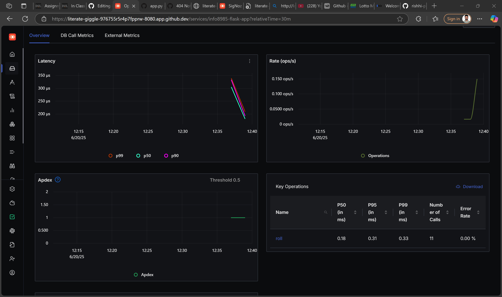
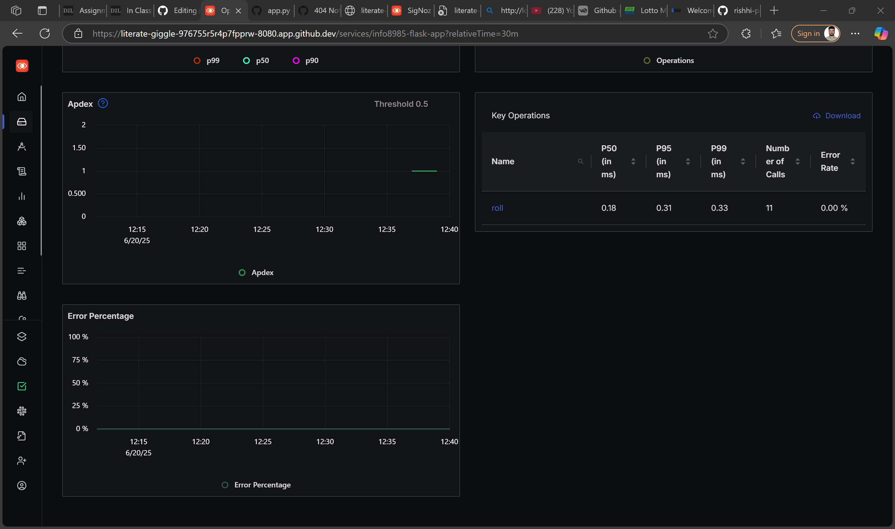

# 🧠 INFO8985 Flask Monolith – Observability with OpenTelemetry + SigNoz

This project demonstrates full observability (logging, tracing, and metrics) for a Python Flask monolithic application using **OpenTelemetry** and **SigNoz**.

> ✅ Built and tested in GitHub Codespaces  
> ✅ Real-time visibility using SigNoz  
> ✅ Includes error tracking and custom metrics

---

## 📌 Technologies Used

| Tool               | Purpose                                  |
|--------------------|-------------------------------------------|
| Flask              | Python web framework                     |
| OpenTelemetry SDK  | Instrumentation (logs, traces, metrics)  |
| SigNoz             | Observability backend (view everything)  |
| Docker Compose     | For running SigNoz locally               |

---

## 🎯 Project Goals

- ✅ Add OpenTelemetry to an existing Flask monolith  
- ✅ Send traces, metrics, and logs to SigNoz  
- ✅ Capture and display exceptions  
- ✅ Create meaningful dashboards in SigNoz

---

## 🧰 Setup Instructions

### 1. Clone This Repo

```bash
git clone https://github.com/jpremchander/info8985_monolith_analysis.git
cd info8985_monolith_analysis
```

### 2. Install Python Dependencies

```bash
pip install flask opentelemetry-sdk \
    opentelemetry-exporter-otlp \
    opentelemetry-instrumentation-flask
```

### 3. Clone SigNoz as Submodule

```bash
git submodule update --init --recursive
cd signoz/deploy/docker
docker-compose up -d
```

🧭 SigNoz UI: [http://localhost:8080](http://localhost:8080)

> Wait ~2 minutes for containers to become healthy.

---

## 🚀 Run the Flask App

In the root folder:

```bash
python app.py
```

✅ Flask will start on: `http://localhost:5000`

---

## 🔎 Available Endpoints

| Method | Endpoint             | Description                                |
|--------|----------------------|--------------------------------------------|
| GET    | `/rolldice`          | Roll a 6-sided dice                        |
| GET    | `/rolldice?player=Me`| Attach player name to log/trace            |
| GET    | `/rolldice?sides=0`  | Triggers an exception (for testing errors) |

---

## 📊 Observability Features in SigNoz

### 🟣 Traces

- Span: `roll`
- Attributes: `roll.value`, `player`
- Visible in **Traces tab → info8985-flask-app**

📷 







### 🟢 Metrics

- Custom counter: `dice.rolls`
- Label: `roll.value`
- Viewable via dashboard panel

📷 *Paste screenshot here of the "dice.rolls" metrics dashboard*

### 🔵 Logs

- Collected using OpenTelemetry’s logger
- Level: `INFO`, `WARNING`, `ERROR`
- Search: `"rolling the dice"` or `"Error occurred"`

📷 *Paste screenshot here showing logs in SigNoz Logs tab*

### 🔴 Exceptions

- Tracked using `record_exception` and span status
- Viewable as red spans in the **Traces** tab
- Used in computing **Error Rate %**

📷 *Paste screenshot here of the error trace (e.g. /rolldice?sides=0)*

---

## 📈 Example Dashboard Panels

| Panel Type | Metric Source | Description                  |
|------------|---------------|------------------------------|
| Time Series| `dice.rolls`  | Count of rolls per value     |
| % Number   | Traces        | Error Rate (`status.code`)   |
| Bar Chart  | Logs          | Top players rolling          |
| Apdex Score| Traces        | End-user satisfaction        |

📷 *Paste full screenshot here of your final custom dashboard*

---

## 🧑‍💻 Author

- Name: *Premchander J*
- Student ID: *[Insert your ID here if needed]*
- Course: INFO8985 – Database Automation

---

## 🧼 Cleanup

To stop all containers:

```bash
cd signoz/deploy/docker
docker-compose down
```

---

## 📬 Questions?

Raise an issue or reach out to the course instructor for help.
