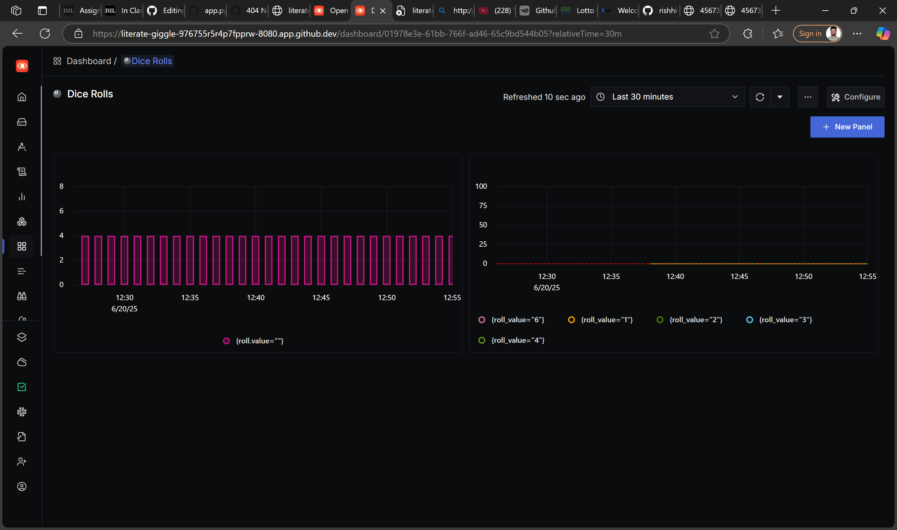
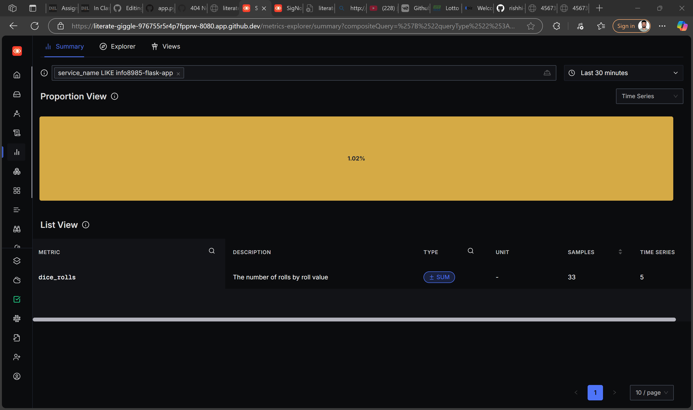
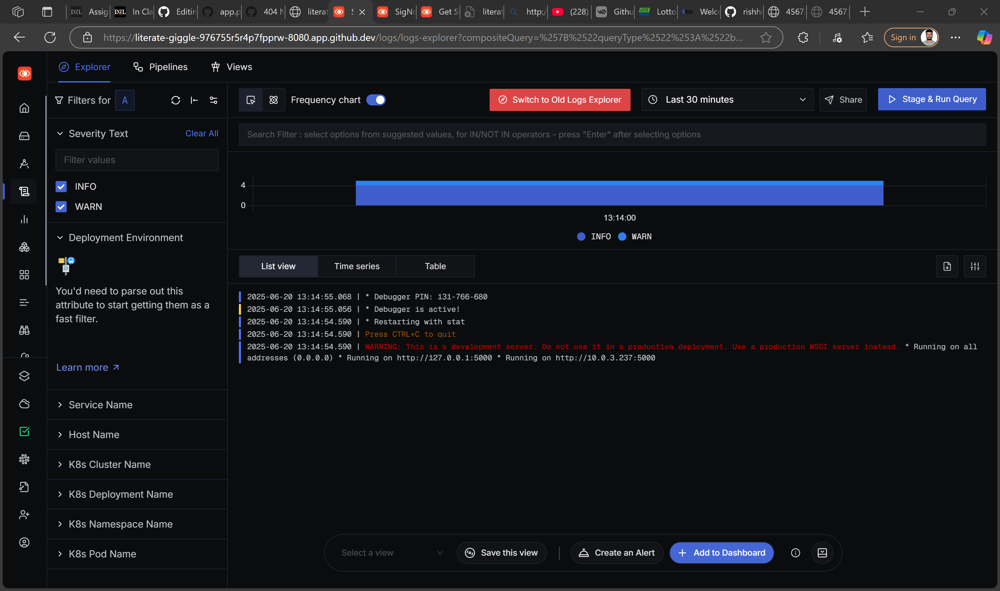
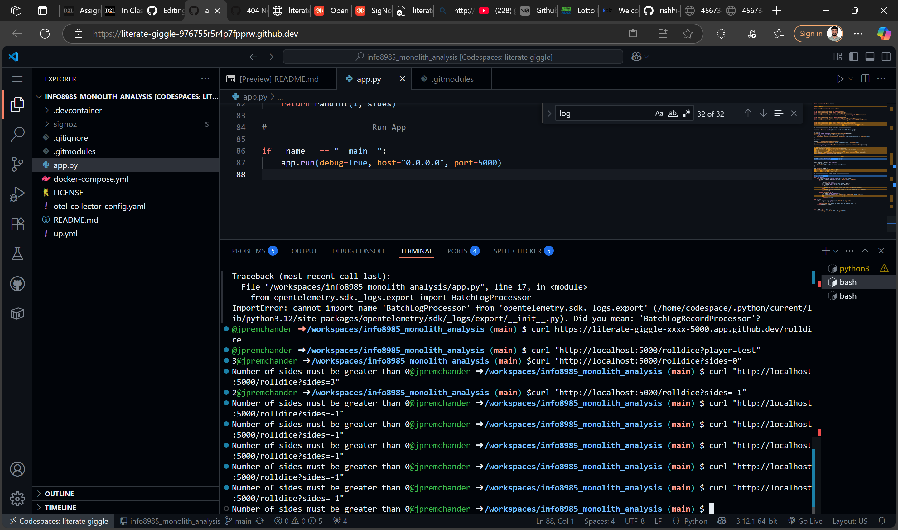
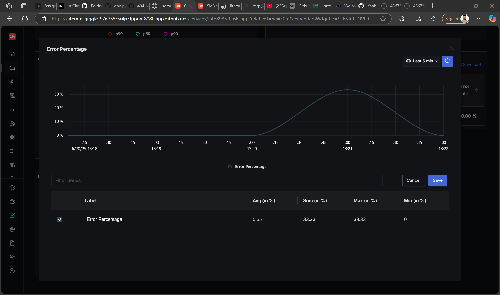

# 🧠 INFO8985 Flask Monolith – Observability with OpenTelemetry + SigNoz

This project demonstrates full observability (logging, tracing, and metrics) for a Python Flask monolithic application using **OpenTelemetry** and **SigNoz**.

> ✅ Built and tested in GitHub Codespaces  
> ✅ Real-time visibility using SigNoz  
> ✅ Includes error tracking and custom metrics

---

## 📌 Technologies Used

| Tool               | Purpose                                  |
|--------------------|-------------------------------------------|
| Flask              | Python web framework                     |
| OpenTelemetry SDK  | Instrumentation (logs, traces, metrics)  |
| SigNoz             | Observability backend (view everything)  |
| Docker Compose     | For running SigNoz locally               |

---

## 🎯 Project Goals

- ✅ Add OpenTelemetry to an existing Flask monolith  
- ✅ Send traces, metrics, and logs to SigNoz  
- ✅ Capture and display exceptions  
- ✅ Create meaningful dashboards in SigNoz

---

## 🧰 Setup Instructions

### 1. Clone This Repo

```bash
git clone https://github.com/jpremchander/info8985_monolith_analysis.git
cd info8985_monolith_analysis
2. Install Python Dependencies

pip install flask opentelemetry-sdk \
    opentelemetry-exporter-otlp \
    opentelemetry-instrumentation-flask
3. Clone SigNoz as Submodule

git submodule update --init --recursive
cd signoz/deploy/docker
docker-compose up -d
🧭 SigNoz UI: http://localhost:8080   https://literate-giggle-976755r5r4p7fpprw-8080.app.github.dev/home

Wait ~2 minutes for containers to become healthy.

🚀 Run the Flask App
In the root folder:

python app.py
✅ Flask will start on: http://localhost:5000

🔎 Available Endpoints
Method	Endpoint	Description
GET	/rolldice	Roll a 6-sided dice
GET	/rolldice?player=Me	Attach player name to log/trace
GET	/rolldice?sides=0	Triggers an exception (for testing errors)

📊 Observability Features in SigNoz

Dashboard:



🟣 Traces
Span: roll

roll-spantrace-attributes.png

Attributes: roll.value, player

roll-spantrace-attributes-2.png

Visible in Traces tab → info8985-flask-app

🟢 Metrics

Custom counter: dice.rolls



Label: roll.value

Create a time series panel in Dashboard

🔵 Logs
Collected using OpenTelemetry’s logger



Level: INFO, WARNING, ERROR

Search: "rolling the dice" or "Error occurred"

🔴 Exceptions
Tracked using record_exception and span status

Viewable as red spans in the Traces tab

Used in computing Error Rate %





📈 Example Dashboard Panels
You can create the following:

Panel Type	Metric Source	Description
Time Series	dice.rolls	Count of rolls per value
% Number	Traces	Error Rate (status.code)
Bar Chart	Logs	Top players rolling
Apdex Score	Traces	End-user satisfaction

⚠️ Known Issues / Fixes
Service not showing in SigNoz?

Make sure you're hitting the /rolldice route

service.name must be set in Resource.create(...)

No logs in SigNoz?

Ensure OTLPLogExporter and LoggingHandler are configured

Restart the app after adding log processor

🧑‍💻 Author
Name: Premchander J

Student ID: 9015480

Course: INFO8985 – Database Automation

📎 Screenshots (for submission)
✅ Flask app service in SigNoz

✅ roll span trace with attributes

✅ Logs tab with rolling the dice

✅ Error trace using sides=0

✅ Custom metric chart dice.rolls

🧼 Cleanup
To stop all containers:


cd signoz/deploy/docker
docker-compose down

🧠 How It Works
The app uses:

opentelemetry.sdk.trace.TracerProvider to send spans

opentelemetry.sdk.metrics.MeterProvider for metrics

opentelemetry.sdk._logs.LoggerProvider for logs

All three use gRPC OTLP Exporters and are visible in SigNoz’s:

Traces tab

Logs tab

Dashboards tab